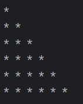
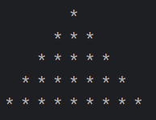
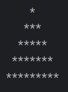

 ### Kotlin Programming Task
 ## 1: Drawing a Right-Angled Triangle
 * Write a Kotlin program that draws a right-angled triangle of stars with a height of 5.
 * 
 * 
    
 
* <h5>Right-Angled.png</h5>

 ## 2: Drawing an Isosceles Triangle
   * Write a Kotlin program that draws an isosceles triangle of stars with a height of 5.
   *  
   

* <h5>Isosceles-Triangle.png</h5>
*  
* ## 2: Drawing a Pyramid 
   * Write a Kotlin program that draws a pyramid of stars with a height of 5.
   *  
   

* <h5>Pyramid.png</h5>
* 