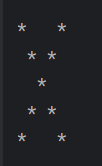

 ### Kotlin Programming Task
 ## 1: Drawing a Right-Angled Triangle
 * Write a Kotlin program that draws a right-angled triangle of stars with a height of 5.
 * 
 * 
    
 
* <h5>Right-Angled.png</h5>

 ## 2: Drawing an Isosceles Triangle
   * Write a Kotlin program that draws an isosceles triangle of stars with a height of 5.
   *  
   

* <h5>Isosceles-Triangle.png</h5>
*  
* ## 3: Drawing a Pyramid 
   * Write a Kotlin program that draws a pyramid of stars with a height of 5.
   *  
   

* <h5>Pyramid.png</h5>
*
## 4: Drawing a Diamond Shape
   *  Write a Kotlin program that draws a diamond shape of stars with a height of 5.
      //   - The diamond shape should be centered and consist of stars with spaces around it to form the diamond pattern.
   *  
   

* <h5>diamondShape.PNG</h5>

## 5: Counting Vowels in a String
 * Write a Kotlin program that counts the number of vowels (a, e, i, o, u) in the string "Kotlin is awesome".
 * The function vowelsInString calculates how many vowels are present in the given string "Kotlin is awesome". The vowels are identified by checking if each character in the string belongs to the set of vowels defined in the vowel variable.

 

